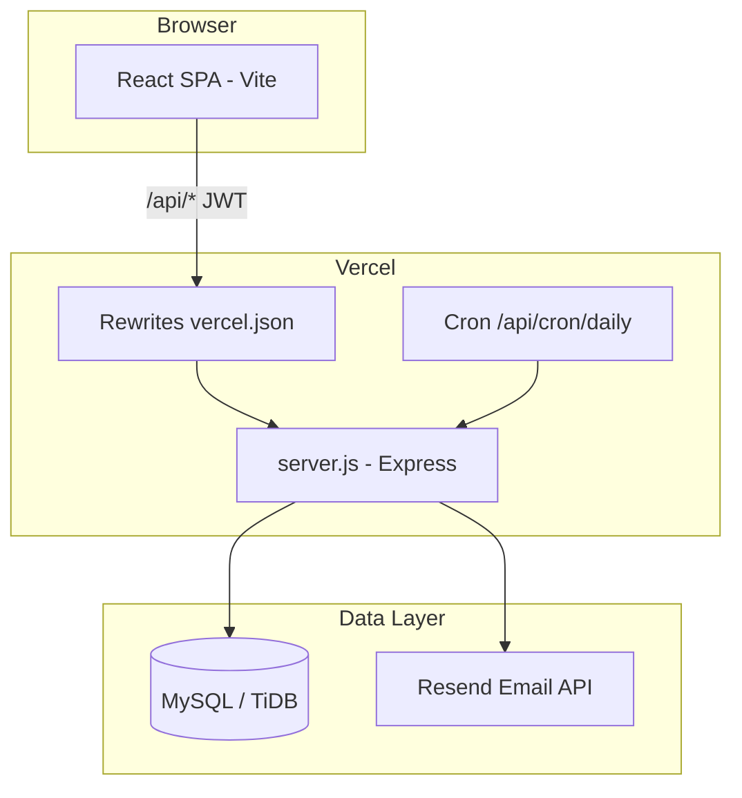

<div align="center">

# 💰 WebKeuangan

### Aplikasi manajemen keuangan pribadi — modern, aman, dan siap produksi

**TendouAriisu — Keuangan** · Full-stack · React + Express + MySQL

[](https://nodejs.org/)
[](https://react.dev/)
[](https://expressjs.com/)
[](https://www.mysql.com/)
[](https://vitejs.dev/)
[](https://vercel.com/)

[Fitur](#-fitur-lengkap) ·
[Tech Stack](#-bahasa--teknologi) ·
[Algoritma](#-algoritma--logika-inti) ·
[Instalasi Lokal](#-menjalankan-di-lokal) ·
[Deploy](#-deploy-ke-vercel) ·
[Panduan Penggunaan](#-panduan-penggunaan)

</div>

---

## 📖 Tentang Proyek

**WebKeuangan** adalah aplikasi web untuk mencatat, menganalisis, dan mengelola keuangan pribadi. Satu dashboard memuat transaksi, dompet, anggaran, tabungan, langganan, utang/piutang, jurnal keuangan, serta vault akun digital — dengan autentikasi JWT, OTP email, dan enkripsi data sensitif.

Proyek ini dirancang **monorepo** dengan backend API terpisah dan frontend SPA, di-deploy sebagai satu aplikasi di **Vercel** (API serverless + static frontend).

---

## 🗂️ Struktur Proyek

```
webkeuangan/
├── backend/                 # API REST (Node.js + Express)
│   ├── server.js            # Entry point, auth, transaksi, admin
│   ├── routes/features.js   # Dompet, utang, kategori, cron alert
│   ├── lib/                 # Wallet, cron, OTP, enkripsi, email
│   ├── config/              # Konstanta (OTP, rate limit, admin)
│   ├── migrate*.js          # Skrip migrasi database
│   └── seed.js              # Buat tabel dasar + akun demo
├── frontend/                # UI (React + Vite)
│   └── src/
│       ├── pages/           # Dashboard, Login, Admin, modul fitur
│       ├── components/      # Toast, alert, konfirmasi, footer
│       ├── services/        # Axios + cache client
│       └── hooks/           # Kategori custom
├── vercel.json              # Routing API + SPA + cron harian
├── ca.pem                   # Sertifikat SSL DB (opsional, cloud)
├── .env                     # Variabel lingkungan (jangan di-commit)
└── README.md                # Dokumentasi ini
```

---

## 🛠️ Bahasa & Teknologi

| Lapisan | Bahasa / Runtime | Framework & Library |
|--------|------------------|---------------------|
| **Frontend** | JavaScript (ES Modules) | React 19, React Router 7, Vite 8 |
| **Backend** | JavaScript (CommonJS) | Express 5, Node.js |
| **Database** | SQL | MySQL / MariaDB / TiDB (via `mysql2`) |
| **Auth** | — | JWT, bcryptjs |
| **Email** | — | Resend API (OTP registrasi & reset password) |
| **Grafik & Export** | — | Chart.js, react-chartjs-2, SheetJS (`xlsx`) |
| **Deploy** | — | Vercel (Node serverless + static build) |

### Dependensi utama

**Backend:** `express`, `mysql2`, `jsonwebtoken`, `bcryptjs`, `cors`, `dotenv`, `multer`, `nodemailer`  
**Frontend:** `axios`, `chart.js`, `react-chartjs-2`, `date-fns`, `lucide-react`, `xlsx`

---

## ✨ Fitur Lengkap

### 🔐 Autentikasi & Keamanan

| Fitur | Deskripsi |
|-------|-----------|
| Login / Register | Registrasi dengan **OTP 5 digit** via email (Resend) |
| Lupa password | Reset password dengan OTP + cooldown percobaan |
| JWT | Token Bearer, masa berlaku 24 jam |
| Rate limiting | 40 req/menit per IP (API); cooldown 2 menit |
| Rate limit OTP | 5 request / 15 menit per IP (forgot/register) |
| Admin tunggal | Satu akun admin (email dikonfigurasi di `adminPolicy`) |
| Enkripsi vault | Password akun digital dienkripsi **AES-256-CBC** di database |

### 💳 Keuangan Inti

| Modul | Fitur |
|-------|--------|
| **Transaksi** | Pemasukan & pengeluaran, kategori, tanggal, catatan, link ke dompet |
| **Dompet** | Multi-wallet (cash / bank / e-wallet), saldo real-time, transfer antar dompet |
| **Kategori** | Kategori custom + warna; rename otomatis sinkron ke transaksi & anggaran |
| **Anggaran** | Limit per kategori per bulan; peringatan ≥80% di UI & email |
| **Tabungan** | Target tabungan + progres setoran |
| **Langganan** | Netflix, Spotify, dll.; reminder jatuh tempo (cron + email) |
| **Utang & Piutang** | Catat utang (`owe`) / piutang (`lent`), cicilan parsial, status lunas |
| **Jurnal** | Catatan harian + mood terkait keuangan |
| **Vault Akun** | Simpan kredensial akun (bank, e-wallet, dll.) terenkripsi |
| **Dashboard** | Grafik doughnut & bar, ringkasan bulanan, export **Excel (.xlsx)** |
| **Profil** | Username, email, foto profil (crop + max 8 MB, base64) |

### 🔔 Notifikasi & Otomatisasi

- **Cron harian** (`/api/cron/daily`, jam 01:00 UTC di Vercel): kirim email alert anggaran/langganan/tabungan
- Preferensi alert per user (budget / subscription / savings) — bisa dimatikan
- Log `alert_sent_log` mencegah email duplikat dalam satu hari

### 👑 Panel Admin

- Statistik agregat sistem (total transaksi, income/expense, user aktif)
- Manajemen user (pagination, tambah/hapus user — admin tidak bisa dihapus)
- Edit transaksi lintas user (jika diperlukan)

---

## 🧠 Algoritma & Logika Inti

### 1. Sinkronisasi saldo dompet (ACID)

Setiap transaksi yang terhubung `wallet_id` mengubah saldo dompet dalam **database transaction**:

```
income  → balance += amount
expense → balance -= amount
```

Saat **edit** atau **hapus** transaksi, sistem membalikkan delta lama (`reverseTransactionWallet`) lalu menerapkan delta baru — agar saldo dompet selalu konsisten.

```javascript
// balanceDelta: income = +amount, expense = -amount
function balanceDelta(type, amount) {
  const n = parseFloat(amount);
  return type === 'income' ? n : -n;
}
```

### 2. Transfer dompet (pessimistic locking)

Transfer memakai `SELECT ... FOR UPDATE` pada dompet asal & tujuan, validasi saldo cukup, lalu `UPDATE balance` atomik dalam satu transaksi SQL.

### 3. Cicilan utang (partial payment)

```
applied = min(nominal_bayar, sisa_utang)
paid_amount += applied
```

Tidak boleh bayar jika utang sudah lunas; edit utang hanya jika `paid_amount = 0`.

### 4. OTP registrasi & reset password

- OTP 5 digit: `crypto.randomInt(10000, 100000)`
- Hash OTP disimpan (bukan plain text)
- Maks **3 percobaan** → lock **10 menit**
- OTP kedaluwarsa **5 menit**
- Cooldown kirim ulang per email

### 5. Enkripsi vault akun (AES-256-CBC)

```
Key = scrypt(JWT_SECRET, 'salt', 32 bytes)
IV  = random 16 bytes per record
Cipher = AES-256-CBC(plaintext)
Stored = hex(IV) + ':' + hex(ciphertext)
```

### 6. Rate limiter API (in-memory)

Sliding window per IP: **40 request / 60 detik** → block **2 menit**. Cocok untuk lingkungan serverless Vercel (tanpa Redis).

### 7. Alert email (agregasi SQL)

- **Anggaran:** `SUM(expense)` per kategori bulan berjalan ≥ **80%** limit → email peringatan/habis
- **Langganan:** `next_billing_date` dalam 3 hari ke depan
- **Tabungan:** progres mendekati target (lihat `cronJobs.js`)

Dedup: `INSERT IGNORE` ke `alert_sent_log` dengan key unik per hari.

### 8. Rename kategori (konsistensi data)

Saat nama kategori diubah, satu transaksi SQL memperbarui `transactions` dan `budgets` yang memakai nama lama.

---

## 🏗️ Arsitektur



**Alur request lokal:** Frontend `:5173` → proxy Vite → Backend `:5000` → MySQL

---

## 📋 Prasyarat

- [Node.js](https://nodejs.org/) **18+** (disarankan LTS)
- [MySQL](https://www.mysql.com/) 8+ / MariaDB / [TiDB Cloud](https://tidbcloud.com/) (port default TiDB: `4000`)
- Akun [Resend](https://resend.com/) untuk OTP email (opsional di dev, wajib untuk register/reset)
- [Git](https://git-scm.com/)

---

## 🚀 Menjalankan di Lokal

### 1. Clone repository

```bash
git clone https://github.com/<username>/webkeuangan.git
cd webkeuangan
```

### 2. Buat database

Buat database kosong di MySQL, misalnya:

```sql
CREATE DATABASE webkeuangan CHARACTER SET utf8mb4 COLLATE utf8mb4_unicode_ci;
```

### 3. Konfigurasi environment

Salin contoh env dan isi nilai Anda:

```bash
# Di root proyek (file .env — dipakai backend & frontend proxy)
```

```env
# Database
DB_HOST=localhost
DB_PORT=3306
DB_USER=root
DB_PASSWORD=your_password
DB_NAME=webkeuangan

# Opsional: SSL untuk TiDB Cloud / managed MySQL
# DB_SSL_CA=./ca.pem

# JWT & keamanan
JWT_SECRET=ganti-dengan-string-panjang-acak

# Email OTP (Resend)
RESEND_API_KEY=re_xxxxxxxx
RESEND_FROM=WebKeuangan <onboarding@resend.dev>

# Cron (opsional lokal — untuk test endpoint cron)
CRON_SECRET=secret-cron-anda
```

> **Tips:** Backend memuat `.env` dari folder **root** (`../.env` relatif ke `backend/`). Letakkan file `.env` di `webkeuangan/.env`, bukan hanya di `backend/.env`.

### 4. Install & migrasi backend

```bash
cd backend
npm install

# Tabel dasar + akun demo
node seed.js

# Fitur lanjutan (tabungan, anggaran, langganan)
node migrate_v2.js
node migrate_v3.js
node migrate_v4.js

# OTP & rate limit IP
node migrate-otp.js

# Fitur dompet, utang, kategori (juga auto-run saat server start)
# Schema di lib/schema.js — dijalankan otomatis oleh ensureSchema()
```

### 5. Jalankan backend

```bash
# dari folder backend/
npm start
# Server berjalan di http://localhost:5000
```

### 6. Install & jalankan frontend

Terminal baru:

```bash
cd frontend
npm install
npm run dev
# Buka http://localhost:5173
```

Proxy Vite mengarahkan `/api` → `http://localhost:5000` (lihat `frontend/vite.config.js`).

### 7. Akun demo (setelah `seed.js`)

| Role | Email | Password |
|------|-------|----------|
| Admin | `muhammadariusni@gmail.com` | `admin123` |
| User | `user@mail.com` | `user123` |

> Ganti password admin setelah login pertama di lingkungan produksi.

---

## ☁️ Deploy ke Vercel

1. Push repo ke GitHub
2. Import project di [Vercel](https://vercel.com)
3. Set **Environment Variables** (sama seperti `.env` di atas)
4. Upload / set `ca.pem` jika DB memakai SSL (`DB_SSL_CA`)
5. Deploy — `vercel.json` sudah mengatur:
   - `/api/*` → `backend/server.js`
   - SPA → `frontend/dist`
   - Cron: `0 1 * * *` → `/api/cron/daily`

**Build frontend di Vercel:** pastikan root build command mengarah ke `frontend` (`npm run build`) dan output `dist`.

**Cron manual (test):**

```bash
curl -H "Authorization: Bearer <CRON_SECRET>" https://<domain-anda>/api/cron/daily
```

---

## 📡 API Ringkas

Semua endpoint (kecuali auth publik) membutuhkan header:

```
Authorization: Bearer <JWT_TOKEN>
```

| Grup | Endpoint | Method |
|------|----------|--------|
| Auth | `/api/auth/login` | POST |
| Auth | `/api/auth/register/request-otp`, `verify` | POST |
| Auth | `/api/auth/forgot-password`, `reset-password` | POST |
| Auth | `/api/auth/me` | GET |
| Transaksi | `/api/transactions` | GET, POST |
| Transaksi | `/api/transactions/:id` | PUT, DELETE |
| Dompet | `/api/wallets`, `/api/wallets/transfer` | GET, POST, PUT, DELETE |
| Kategori | `/api/categories` | CRUD |
| Utang | `/api/debts`, `/api/debts/:id/pay` | CRUD + POST pay |
| Tabungan | `/api/savings` | CRUD |
| Anggaran | `/api/budgets` | CRUD |
| Langganan | `/api/subscriptions` | CRUD |
| Jurnal | `/api/journals` | CRUD |
| Vault | `/api/accounts` | CRUD (terenkripsi) |
| Alert | `/api/alerts/settings` | GET, PUT |
| Profil | `/api/users/profile`, `profile-image`, `password` | PUT, POST |
| Data | `/api/users/delete-all-data` | DELETE |
| Admin | `/api/admin/stats`, `/api/users` | GET, POST, DELETE |
| Cron | `/api/cron/daily` | GET (Bearer `CRON_SECRET`) |

---

## 📱 Panduan Penggunaan

### Registrasi & login

1. Buka aplikasi → **Daftar** → isi username, email, password
2. Cek email → masukkan **OTP 5 digit** (berlaku 5 menit)
3. Login dengan email & password

### Dashboard & transaksi

1. Tab **Dashboard** — lihat ringkasan pemasukan/pengeluaran & grafik
2. **+ Tambah Transaksi** — pilih tipe, nominal, kategori, dompet (opsional), tanggal
3. **Export Excel** — unduh semua transaksi ke `Laporan_Transaksi.xlsx`

### Dompet & transfer

1. Menu **Dompet** — buat dompet (tunai/bank/e-wallet)
2. Setiap transaksi dengan dompet akan mengupdate saldo otomatis
3. **Transfer** antar dompet dengan validasi saldo mencukupi

### Anggaran & peringatan

1. Menu **Anggaran** — set limit per kategori untuk bulan `YYYY-MM`
2. Dashboard menampilkan peringatan jika pengeluaran ≥ 80%
3. **Pengaturan Alert** — aktif/nonaktif email budget, langganan, tabungan

### Fitur lain

| Menu | Cara pakai singkat |
|------|-------------------|
| **Tabungan** | Buat target → tambah setoran → pantau progres % |
| **Langganan** | Catat nama, nominal, siklus, tanggal tagihan berikutnya |
| **Utang/Piutang** | Tambah pihak lawan → catat cicilan → status lunas otomatis |
| **Kategori** | Custom nama & warna untuk grafik/transaksi |
| **Jurnal** | Tulis refleksi harian + pilih mood |
| **Vault Akun** | Simpan login akun digital (password dienkripsi di server) |
| **Profil** | Edit nama/email, upload foto (crop lingkaran) |
| **Admin** | Hanya role `admin` — kelola user & lihat statistik |

### Reset semua data

Di pengaturan profil: **Hapus semua data** — menghapus transaksi, dompet, anggaran, dll. tanpa menghapus akun login.

---

## 🔒 Keamanan & Best Practice

- Jangan commit `.env`, `ca.pem`, atau log debug ke Git
- Gunakan `JWT_SECRET` panjang dan acak di produksi
- Set `CRON_SECRET` untuk mencegah pemanggilan cron sembarangan
- Ganti password akun demo setelah deploy
- Database production: aktifkan SSL (`DB_SSL_CA`) untuk koneksi terenkripsi

---

## 🧪 Perintah Berguna

```bash
# Backend
cd backend && npm start          # Jalankan API
node seed.js                     # Seed + tabel users/transactions
node migrate-otp.js              # Tabel OTP

# Frontend
cd frontend && npm run dev       # Development
cd frontend && npm run build     # Build produksi
cd frontend && npm run preview   # Preview build
```

---

## 📄 Lisensi

Proyek ini untuk penggunaan pribadi / portofolio. Sesuaikan lisensi (MIT, dll.) sesuai kebutuhan Anda sebelum publikasi publik.

---

<div align="center">

**Dibuat dengan ❤️ untuk mengelola keuangan lebih rapi**

⭐ Beri star di GitHub jika proyek ini membantu Anda

</div>
